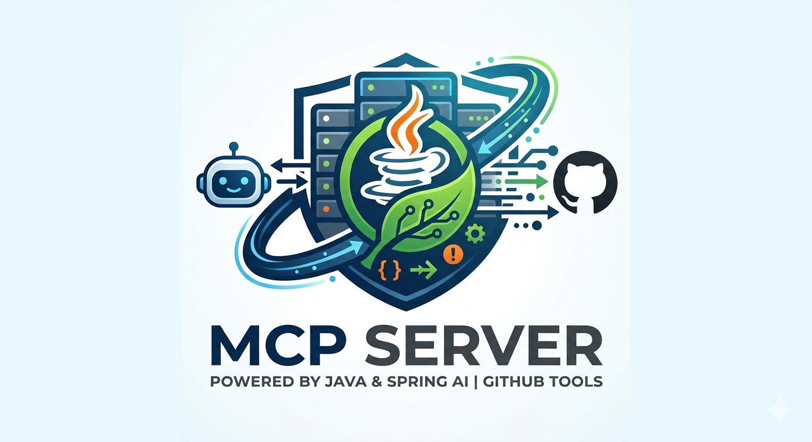
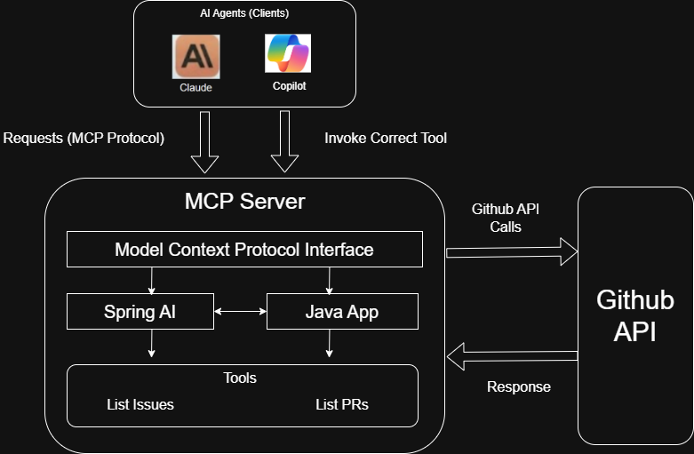

# Github-Assistant-MCP-Server

[](https://sonarcloud.io/project/overview?id=DivyenduDutta_Github-Assistant-MCP-Server)
[](https://sonarcloud.io/dashboard?id=DivyenduDutta_Github-Assistant-MCP-Server)
[](https://sonarcloud.io/dashboard?id=DivyenduDutta_Github-Assistant-MCP-Server)
[](https://sonarcloud.io/dashboard?id=DivyenduDutta_Github-Assistant-MCP-Server)
[](https://github.com/DivyenduDutta/Github-Assistant-MCP-Server/actions)

<p><em>An MCP Server written using Java and Spring AI which exposes tools to allow common AI agents to perform various Github related tasks.</em></p>

<div align="center">
  
  <p>
    <a href="#introduction">Introduction</a> •
    <a href="#architecture">Architecture</a> •
    <a href="#setup">Setup</a> •
    <a href="#usage">Usage</a>
  </p>
</div>

## Introduction

[Model Context Protocol (MCP)](https://modelcontextprotocol.io/docs/getting-started/intro) is a standard open-source protocol 
used to allow common AI agents to interact with external tools in a standard manner.

This project is an implementation of an MCP Server written using Spring AI that exposes tools to allow common AI agents 
such as Copilot, to perform various Github related tasks. Generally, these AI agents aren't able to access repositories,
especially private repositories, and perform actions such as listing issues, listing PR's etc. This server allows these 
agents to perform such actions by exposing tools that they can call.

The tools currently exposed by the MCP server include:
- list_issues_limited: List a specific number of issues in a given repository for a given owner.
- list_issues_default: List a 5 issues in a given repository for a given owner.
- get_issue: Get details about a specific issue.
- list_pull_requests: List general details about all PR's (open PR's for now).
- get_pull_request: Get details about a specific PR.

The philosophy behind designing the MCP tools is : "Agent-friendly, not API-shaped"

## Architecture



## Setup

### Setting up Github Token
Corresponding to `github.token=${GITHUB_TOKEN}` in `application.properties`, an 
environment variable named `GITHUB_TOKEN` will have to be set. This should be a valid Github Personal Access Token (PAT) 
that has the necessary permissions to perform the desired operations on Github. This token will be used by the 
MCP server to authenticate API requests to Github.

### Adding MCP Server to Github Copilot

Go to Tools -> Github Copilot -> Edit Settings... and click on "Model Context Protocol (MCP)" and click on "Configure"
to open `mcp.json`.

Add the below to this json file:
```json
"github-assistant": {
  "type": "streamable-http", 
  "url": "http://localhost:8080/mcp"
}
```

### For Developers

Run the below commands in local before pushing code to remote.

#### Code formatting
```bash
mvnw spotless:check
```

If there are formatting issues, run the below command to fix them.
```bash
mvnw spotless:apply
```

#### Static analysis
```bash
mvnw spotbugs:check
```

#### Style/complexity analysis
```bash
mvnw pmd:check
```

#### Unit tests and Code coverage

Always ensure to add or update unit tests for any new code/features and run all tests before pushing to remote.

Run the below command to execute unit tests and generate code coverage report (for local analysis, if needed).
```bash
mvn clean test -Pcoverage
```

The code coverage report can be
found in `{project.basedir}/code_coverage`. 

SonarCloud is also integrated for
static code analysis and code coverage reporting. The SonarCloud badge at the top of this README reflects the current
status of the project on SonarCloud. All the SonarCloud integration is already handled by Github CI.

## Usage

Run 
```bash
mvn clean package -DskipTests
```
to build the project and generate the jar file.

Process:

1. Start the mcp server via `java -jar /path/to/mcp_server.jar
2. Go to Copilot and ensure its on Agent mode. Click on the wrench and ensure that your mcp tools are listed and active
3. Ask the question. Sometimes we may need to specify the mcp tool name for copilot to use it

Note: We can test the MCP server using `npx @modelcontextprotocol/inspector` which acts as an MCP client. For more
details [see this](https://modelcontextprotocol.io/docs/tools/inspector).

